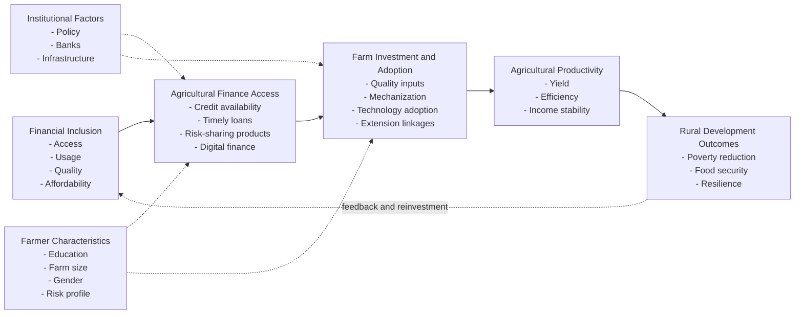

# Conceptual Framework: Financial Inclusion and Agricultural Productivity

```mermaid
flowchart LR
    FI[Financial Inclusion\n- Access\n- Usage\n- Quality\n- Affordability] --> AF[ Agricultural Finance Access\n- Credit availability\n- Timely loans\n- Risk-sharing products\n- Digital finance]
    AF --> INV[Farm Investment and Adoption\n- Quality inputs\n- Mechanization\n- Technology adoption\n- Extension linkages]
    INV --> PROD[Agricultural Productivity\n- Yield\n- Efficiency\n- Income stability]
    PROD --> RD[Rural Development Outcomes\n- Poverty reduction\n- Food security\n- Resilience]
    RD -. feedback and reinvestment .-> FI

    INST[Institutional Factors\n- Policy\n- Banks\n- Infrastructure] -.-> AF
    INST -.-> INV
    FARM[Farmer Characteristics\n- Education\n- Farm size\n- Gender\n- Risk profile] -.-> AF
    FARM -.-> INV
```

